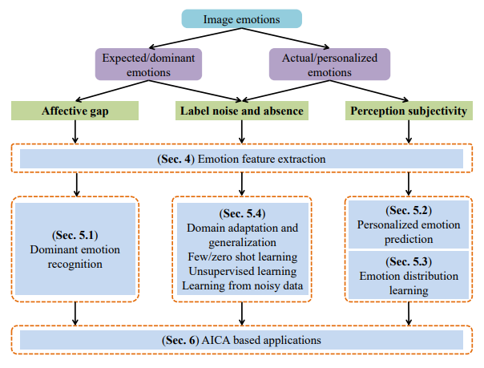

<div align="center">

## Affective Image Content Analysis: Two Decades Review and New Perspectives

<a href="https://pytorch.org/get-started/locally/"></a>
[](https://github.com/exped1230/AICA/blob/main/LICENSE)

</div>

This is the official implement of the related codes in our **TPAMI** paper [Affective Image Content Analysis: Two Decades Review and New Perspectives](https://ieeexplore.ieee.org/document/9472932).

<p align="center">

    <h4 align="center">Overview of AICA</h4>
</p>

## Dataset
The used datasets are provided in our [homepage](http://47.105.62.179:8081/sentiment/index.html).

## Projects
- The source codes of [WSCNet](https://openaccess.thecvf.com/content_cvpr_2018/papers/Yang_Weakly_Supervised_Coupled_CVPR_2018_paper.pdf), [PDANet](https://dl.acm.org/doi/abs/10.1145/3343031.3351062), [RCA](https://ojs.aaai.org/index.php/AAAI/article/view/11275), [Joint](https://www.ijcai.org/proceedings/2017/456) are implemented in WSCNet+PDANet+RCA+Joint.

- The 


## Citation
If you find this code to be useful for your research, please consider citing.
```
@ARTICLE{zhao2022AICA,
  author={Zhao, Sicheng and Yao, Xingxu and Yang, Jufeng and Jia, Guoli and Ding, Guiguang and Chua, Tat-Seng and Schuller, Björn W. and Keutzer, Kurt},
  journal={IEEE Transactions on Pattern Analysis and Machine Intelligence}, 
  title={Affective Image Content Analysis: Two Decades Review and New Perspectives}, 
  year={2022},
  volume={44},
  number={10},
  pages={6729-6751}
}
```


